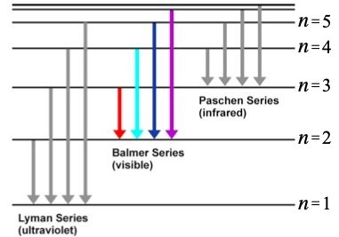
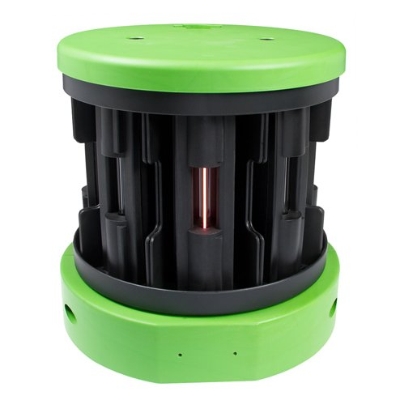
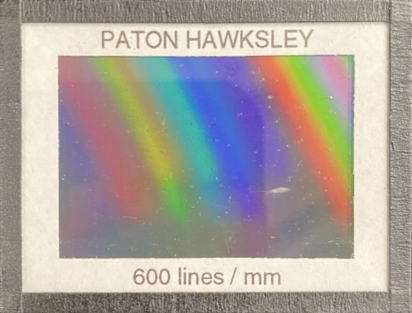
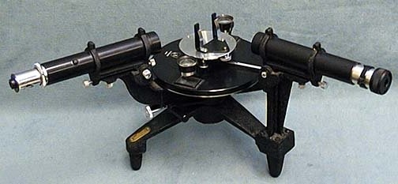
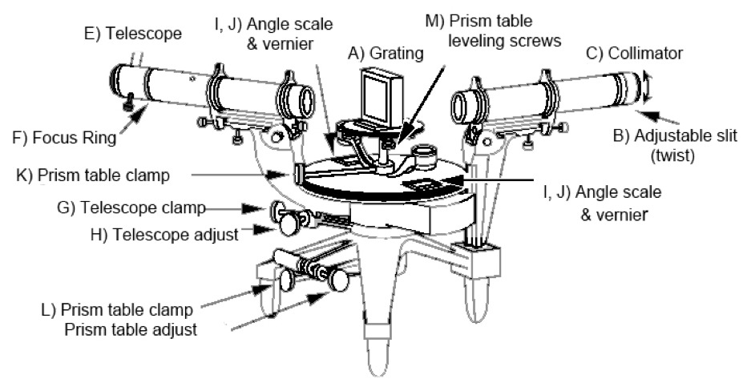
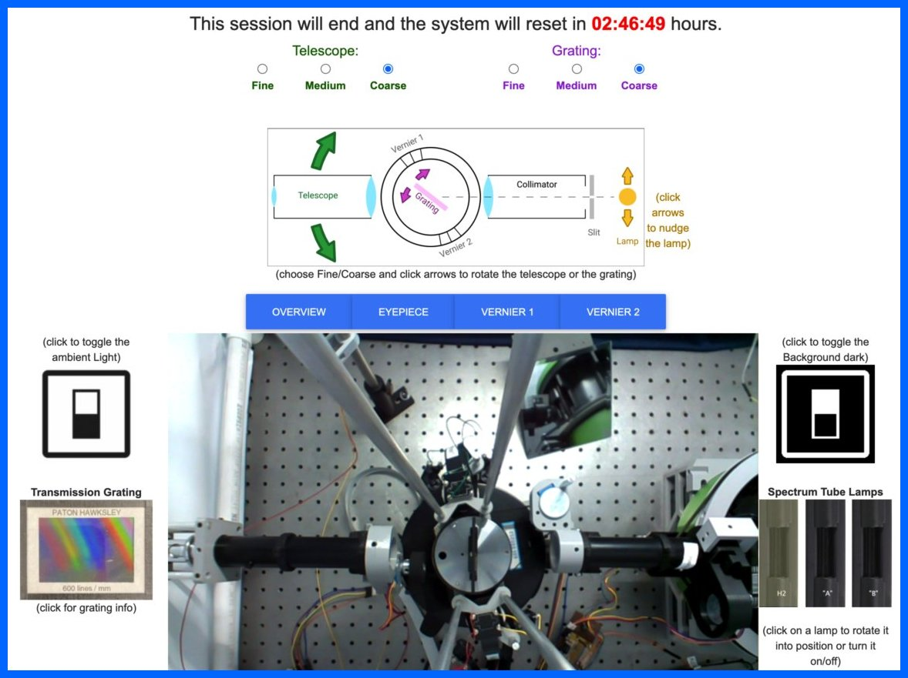

# AAtomic Spectra 
---

**In this lab you will observe the visible spectrum of Hydrogen and use it to measure the Rydberg constant. 
Then you will use the spectrum of two unknown sources to determine their atomic content.**

Background
---------------------

The quantum explanation for atomic structure was developed in the early 1900’s based largely on measurements of the wavelengths of light emitted by atoms in [gas-discharge lamps](https://en.wikipedia.org/wiki/Gas-discharge_lamp).  
These measurements, first made in the late 1800’s, provided evidence that the energy levels of atoms are quantized (*i.e.* have a discrete set of possible values).
In particular, in 1885, Johann Balmer measured the visible spectrum of Hydrogen and found the wavelengths of light that were present were related according to

:::Figure:Equation
$$
\frac{1}{\lambda} = R\left(\frac{1}{2^2}-\frac{1}{n^2}\right); \,\,\,\mathrm{for}\,\,n>2.
$$
:::
The ultraviolet and infrared portions of the Hydrogen spectrum were later measured (by Lyman, Paschen, Brackett and Pfund) and found to fit similar formulas but with integers other than 2 in the first term (and in the inequality). They all measured the same coefficient, $R$, called the Rydberg constant. 

The origin of this formula was eventually understood within the Bohr model of the atom, which posited that the light from Hydrogen consists of photons of energy $E = h\nu = hc/\lambda$ that are emitted by atoms transitioning between electronic states that have discrete energies of $E_n = -hcR/n^2$, where $c$ is the speed of light, $h$ is Planck's constant, $R$ is the Rydberg constant and $n$ is a positive integer (Fig. 1). Transitions from excited states to the $n = 2$ state produce visible light (red to violet, left to right for the four lines shown) that you will observe in this lab. Transitions to the $n = 1$ state produce ultraviolet light, and those to the $n = 3$ state produce infrared light, neither of which can be seen by eye.

:::Figure:Figure

Diagram of the energy levels for a Hydrogen atom. 
:::
 This understanding allowed the Rydberg constant to be formulated in terms of purely fundamental constants like the mass, $m$, and charge, $e$, of the electron and the permittivity of free space, $\epsilon_0$:
 $$
 R = me^4/8\epsilon_0h^3c\,,
 $$
 whereas previously it had been only an empirically determined value.[^1]
 
In this lab, you will measure the visible spectrum of Hydrogen as Balmer originally did and, from it, obtain a measurement of the Rydberg constant.

Note that the Rydberg constant applies only to Hydrogen. Other atoms have a similar $1/n^2$ structure to the equation that describes their spectra, but with a different coefficient. Each element’s spectrum is uniquely characteristic, so spectra are often used to identify the elemental composition of a sample (or a star![^2]). 

**After you completing your measurements of the Hydrogen spectra, you will measure the visible spectra of two unknown samples and use them to identify each sample's elemental composition.**

Instruments
---------------------
The apparatus used in this lab consists of
* **A spectrum tube** -  a special kind of gas-discharge lamp that shapes the light emitted by a gas to optimally illuminate a narrow slit

:::Figure:Figure

:::

* **A carousel** - that rotates to power your choice of three spectrum tubes.  One contains Hydrogen gas and the other two contain gases you will identify based on their spectra. 

:::Figure:Figure

You can see a top-down view of the carousel at the very right of the "overview" live feed, but the view is complicated and obstructed by various 3D-printed parts that help position and motorize the apparatus.  A mirror just to the right of center near the top of the "overview" feed reflects a sideview that clear shows when a lamp is on, off and/or rotating into position.
:::

* **A diffraction grating** - an optical element that uses the phenomenon of interference to send light of different wavelengths in different directions.

:::Figure:Figure

:::

You have learned about interference in the context of collimated light passing through a double slit.  In another lab in this course, you may have experimented with passing light through an array of three, four or five slits.  When collimated light passes through multiple, equally spaced slits, the result is an intensity pattern with maxima and minima at the same positions as in the pattern created by two slits with the same spacing, but with maxima that are much more narrowly peaked, (*i.e.*, the contrast is much improved). 

The diffraction grating you will use was made from an etching of thin parallel lines on a piece of glass. Etched regions scatter light instead of transmitting it, so the non-etched regions between the etched lines act as slits. The etching process allows hundreds or thousands of lines per mm, so this type of diffraction grating has slits that are not only plentiful, but closely spaced as well. 

Because of its very large number of slits, the diffraction grating creates very sharp maxima.  Because of their close spacing, the slits impose a large "lever arm" on the pattern (*i.e.* a greater angular separation between maxima) making it possible to distinguish maxima of subtly different wavelengths.  This can be seen from the equation for constructive interference.  Light passing through slits separated by a distance $d$ will have intensity maxima at angles $\theta_m$ for which 
$$
d \sin \theta_m = m\lambda\,,
$$
where $m$ is any positive integer. The smaller $d$ is, the larger $\theta_m$ will be for the same $\lambda$.

The $m = 0$ case is the central maximum. By measuring $\theta_m$ for $m = 1$ maxima for each of the different wavelengths, you can precisely determine those wavelengths.[^3]  

Note that this equation applies only if the collimated light is "normally incident" on the grating. You may have to adjust the grating to make this be the case.[^4] 

:::Question
What is the spacing $d$ for the diffraction grating?  (Hint: See Figure 4.)
:::

* **A spectroscope** -  which sends collimated light onto the diffraction grating and enables you to measure the various angles at which the light that passes through the grating constructively interferes.

:::Figure:Figure

A manual for the spectropscope is available in PDF format on the web-portal for this experiment. 
:::

:::Figure:Figure

The parts of the spectroscope are more easily distinguished in a diagram.  
(Note that this diagram's vantage point is rotated slightly (~45° CCW) from that in the photo: the arms that are angled toward the viewer in the photo are angled away from the viewer in the diagram.)
:::

Two cylinders define the light path: the collimator (C); and the telescope (E). The collimator has an opening at its far end that only admits light through a vertical slit (B). The width of the slit is narrow but adjustable. It shapes the light beam into a vertical line. Letting the light spread vertically doesn’t degrade the resolution in $\theta$ because $\theta$ is an angle in the horizontal plane. Because a line allows more light to hit the detector, it is much easier to determine the location of a line than a point. The use of vertical slits in spectral measurements is so common that the observed maxima are called *spectral lines*.

The telescope swings to different angles around the grating (A) and images the light that comes through the grating onto a detector.  The lens at the far end of the telescope is called an "eyepiece".  If this were an in person lab, you would look through the eyepiece and your eye would be the detector.  To allow you to view the lines remotely, we have put a webcam behind the eyepiece and made what it sees available to you by clickling on the "eyepiece" button.

The angular position of the telescope is read off of scales (I,J) situated on either side of the spectrometer. The scales measure degrees down to one arc minute with Vernier markings. 
 
Using a Vernier scale takes a bit of explanation and some practice. There are some good extended descriptions online (*e.g.* [in Wikipedia](https://en.wikipedia.org/wiki/Vernier_scale)), so here we’ll introduce it with a few examples specific to the scales you will be using. The scales on the spectroscope consist two sets of uniformly spaced lines that are arranged so that they slide past each other. The lower set's lines mark each half degree, while the upper one's (which are very slightly more closely spaced) have markings corresponding to 0-30 arc minutes. The two scales are used together. 

:::Figure:Figure

:::
Cartoons of two different measurements are shown in Figure 7 to illustrate the procedure. First you look where the zero mark on the inner scale is located. In the left hand cartoon that is to the right of $210^\circ$; in the right hand cartoon it is to the right of $229.5^\circ$. Then you look where the lines on the inner and outer scales align most closely. In the left hand cartoon that happens for the $15^\prime$ mark; on the right side it happens at the $16^\prime$ mark. These measure the number of arc minutes to add to the values obtained from the first step. So, the measurement on the left side is $210^\circ + 15^\prime = 210^\circ + (15/60)^\circ = 210.250^\circ$, and the measurement on the right is $229.5^\circ + 16^\prime = 229.5^\circ + (16/60)^\circ = 229.767^\circ$. 

:::Question
What is the angular position indicated by the vernier scales in the photo in the middle of Figure 7? 
:::

The precision of these $\theta$ readings is limited by the one arc minute granularity of the Vernier scale, but it is possible to make mistakes in reading or calculating the values.** Here are a few things you can do to reduce the chance of such mistakes and their impact:**
1. Have someone else (*e.g.* your lab partner) make the same reading (without telling them what you got) and compare. 
2. Recall that the position of the telescope can be read off of scales situated on either side of the spectrometer. The angles recorded by the two scales should differ by exactly $180^\circ$. Read and record both. If, after correcting for the $180^\circ$ difference, you find that their values differ by more than the $0.005^\circ$ precision of the scales, something is wrong - if not with your readings, then with the spectrometer itself (*e.g., warping of the scales). This approach of making multiple, independent measurements of the same quantity is always a good idea and helps validate your results.
3. Record your raw readings in degrees and arc minutes, and then calculate the corresponding decimal degree values. This will help you disentangle any calculation errors that may occur. While the calculations in this case are not complicated, and the consequences of a mistake are small, this sort of fastidious data recording is a good habit to develop for professional laboratory work, when both the chances and consequences of mistakes increase.

Finally, be aware that the Verniers read angular position but the location of $0^\circ$ is arbitrary. 

In order to determine the wavelength using $d\sin\theta = \lambda$, where $\theta$ is the angle between maxima, you need to measure two angles and subtract, just like measuring a length requires two position measurements. You could do this by measuring the angular position of the central maximum, which we can call $\theta_0$ , and the angular position of the $m = +1$ maximum, which we can call $\theta_{+1}$. Then $\lambda = d\sin(\theta_{+1}-\theta_0)$. Similarly, you could measure the angular position of the $m = +2$ maximum and use $2\lambda = d \sin (\theta_{+2}-\theta_0)$ or $\lambda = d \sin (\theta_{+2}-\theta_{+1})$. **Finally, note that the direction in which the angles increase or decrease on the scale is arbitrary, so you should use the absolute value of the differences.**

Approach
---------------------
**Using the instruments above, you will determine the wavelengths of light emitted by three different gasses.**

The web-portal for this experiment enables you to manipulate the spectroscope, see the lines and read the verniers just as you would in person.  

:::Figure:Figure

Note the timer at the top of the portal (in red).  When it runs out, the lab equipment will reset to its initial configuration.
:::

:::Exercise

When you first open the portal the video feed will be dark.  A row of blue buttons immediately above the video feed lets you select among four cameras. 
OVERVIEW gives a top-down view of the apparatus, centered on the diffraction grating; 
EYEPIECE shows the view through the eyepiece; 
VERNIER1 and VERNIER2 each look at one of the two Vernier scales. 
::: Figure::: Figure

:::
* Click on OVERVIEW, then click on the central square of the white switch to the *left* of the video display to turn on the ambient light. 

The ambient light lets you observe the setup and better see the machinery respond to your clicks. 

* Click on EYEPIECE.

Ambient light reflecting off of the diffraction grating lights up the circular field of view of the eyepiece. It can't be confused for the vertical lines of light from the lamp, but it can make it hard for you to see very dim lines, so you should consider turning off the ambient light when taking your data.

* Click on one of the two VERNIER buttons and read the angular position of the telescope.

:::Question
What is the angular position of the telescope?
:::

::: Figure::: Figure

:::

Above the camera control buttons is a schematic of the spectrometer.  Green, pink and yellow arrows in the schematic enable you to move the telescope, grating and lamp, respectively. Correspondingly colored radio buttons allow you to change the amount moved per click. 

* Use the green arrows and radio buttons to move the telescope until the VERNIER reading is within 1° of 45° or 225°, whichever is closer to your starting point.

:::Question
What is the angular position of the telescope now? 
:::

:::Question
Describe what you did to get it there.
:::
* Switch back to the OVERVIEW camera and look at the orientation of the grating.  

The collimator and the telescope should be co-linear.  

* Use the pink arrows and radio buttons to rotate the grating until it is perpendicular to the collimator.[^4]

* Click on the image of the "H2" spectral lamp to the right of the video display.

:::Question
What color is the light from the H2 lamp?
:::

* After the lamp turns on, switch to the EYEPIECE camera. 

You should see the illuminated slit near the center of the field of view.

* Click the yellow arrows in the schematic to nudge the lamp and maximize the intensity of the light coming through the slit.

Notice that two new controls appear when you select the Eyepiece view.  
:::Figure:Figure

:::

On the left is a button that lets you position a set of crosshairs over the live feed.  
* Click the button to activate the crosshairs, then move your cursor over the live feed to see them following your cursor.
* Click to lock the crosshairs in place.  
* Click again to release and have them follow your cursor again.  
The coordinates of the center of the crosshairs are displayed in the upper left corner of the live feed.

On the right is a photo of the slit with green arrows that let you change its width among three settings.  

:::Question
How many pixels wide is the slit in each setting? (Hint: use the crosshairs.)
::::

* Adjust the slit to its narrowest setting.
* Turn off the ambient light.
* Click on the central square of the black switch to the *right* of the video display to toggle the portal's background from white to black and back again.

Keep in mind that this can be helpful when viewing very dim lines.  
:::

Measurement
-----------
Now that you have familiarized yourself with the spectroscope and have it aligned on the central maximum, you are ready to measure the Hydrogen spectrum!

:::Exercise
### Data Collection

* Select the green radio button for coarse movement of the telescope.
* Look for the four hydrogen emission lines by moving the telescope in one direction. 

:::Question
In which direction did you move the telescope?
:::

:::Question
Which color line appears closest, and which appears furthest, from the central maximum?  
:::

Note that the violet line is the dimmest of the four and can be difficult to see. You can increase the slit width to make the lines easier to see, but you will want to balance the need for visibility with the desire for narrow lines that can be measured more precisely. 

* Move the telescope back until the central maximum is in view.
* Look for the four emission lines by moving the telescope in the other direction. 

:::Question
How do the intensities of the lines in this direction compare with the ones you saw in the other direction?
:::

Diffraction gratings are often designed to concentrate most of the diffracted energy in a particular maximum for a given wavelength. This is done by shaping, or "blazing" the grooves to have a triangular profile.  The grating in this apparatus is blazed for an $m=+1$ maximum of a visible wavelength, which is why the lines are much brighter on one side of the central maximum compared to the other.

* Move the telescope back until the central maximum is centered in the EYEPIECE view.

:::Question
What is the horizontal position of the central maximum in the live feed? (Hint: use the crosshairs.)
:::

:::Question
What is the angular position of the telescope?  Remember to record the readings from both VERNIER1 and VERNIER2.
:::

* Move the telescope in the direction of the brighter lines. 
* One at a time, bring each line to the same horizontal position the central maximum was previously at (as indicated by the crosshairs).

:::Question
What are the colors and angular positions of each of the four $m=1$ lines? Remember to record the readings from both VERNIER1 and VERNIER2.
:::

:::Question
Can you see any of the $m=2$ lines?  Note the angular position and color of any you can see. Remember to record the readings from both VERNIER1 and VERNIER2.
:::

* Move the telescope back in the other direction and and find the $m=-1$ lines.

:::Question
What are the colors and angular positions of the $m=-1$ lines that you can see?  Remember to record the readings from both VERNIER1 and VERNIER2.
:::
::::

You may see a background of colors in addition to the main bright lines. This background is typically due to the ultraviolet light emitted by the hydrogen lamp exciting other atoms to emit. In fact, that is how fluorescent lights work. Ultraviolet emission produced by running a current through the gas in a long tube excites atoms in the white fluorescent material that coats the inside of the tube. That material then emits a large number of different wavelengths that we perceive as white light. 

::: Exercise
### Data Analysis
In a spreadsheet, calculate the $\theta_m$ values of the various lines from the angular positions you measured. Recall that $\theta_m$  = $\theta$ central maximum - $\theta$ m =1 lines.

:::Question
Which angular positions did you subtract for each value of $\theta_m$?
:::

Using the $\theta_m$ values you calculated and the condition for constructive interference (given in the diffraction grating section above), calculate the wavelengths of each of the Balmer lines.

:::Question
What is the wavelength you measured for the $n=3$ Balmer line?  
:::

:::Question
What are the wavelengths you measured for the $n={4,5,6}$ Balmer lines?  
:::

Look at Equation 1 :
$$
\frac{1}{\lambda} = R\left(\frac{1}{2^2}-\frac{1}{n^2}\right); \,\,\,\mathrm{for}\,\,n>2.
$$

:::Question
To make a plot of your data that will let you fit a straight line whose slope will be the Rybderg constant, $R$, what should you plot on the $y$-axis?  What should you plot on the $x$-axis?
:::

$\Rightarrow$**Make this the well-formatted plot you submit for grading. **$\Leftarrow$

:::Question
What is the value of the Rydberg constant indicated by your data? 
:::

The currently accepted value of the Rydberg constant is $R=0.0109678~\mathrm{nm}^{-1}$.[^5]

:::Question
How large a fraction of the accepted value is the discrepancy between your measurement of the Rydberg constant and the accepted value?

Calculate this *proportionate discrepancy* by taking the difference and dividing it by the accepted value:
$$
\frac{|R_\mathrm{measured}-R_\mathrm{accepted}|}{R_\mathrm{accepted}}\,.
$$
Give your answer as a percentage.
:::
:::

:::Exercise
### Identify the unknowns
There are two other spectral lamps in the carousel, labeled "A" and "B".  They are each filled with one of the Noble gases.  At the bottom of the web-portal are two copies of the following image naming the five noble gases:

:::Figure

:::
Click on one of the boxes naming an element to see its detailed spectrum and on the other to see the wavelengths and relative intensities of its major peaks.

* Click on one of the lamps.
* Use the spectrometer to determine the $\theta_1$ values for four of the brightest lines from this lamp.
* Use the condition for constructive interference to calculate their wavelengths.

:::Question
Which lamp did you choose?
:::
:::Question
In order of brightness, starting with the brightest, what are the $\theta_1$ values of those four lines?  What are their wavelengths.  For full credit, show your work.
:::
:::Question
Which element is in this lamp?  Explain your reasoning.
:::

* Repeat for the other lamp.
:::Question
In order of brightness, starting with the brightest, what are the $\theta_1$ values of those four lines?  What are their wavelengths.  For full credit, show your work.
:::
:::Question
Which element is in this lamp?  Explain your reasoning.
:::

:::

#### (Click on the footnote number to return to its position in the main text.)

[^1]: Interestingly, the measured value of $R$ did not match the prediction of the simplest Bohr model which uses $m = m_e$ because the electron and proton together lead to an effective “reduced mass”, $m$, that is very slightly below the electron mass. Furthermore, the spectrum of hydrogen was found to contain a set of wavelengths with a slightly different $R$ value. These come from deuterium, which is hydrogen with a neutron in the nucleus, the mass of which further alters $m$). Both effects are smaller than 0.1% and only revealed by exquisitely precise measurements.

[^2]: It is amusing to note how often dialogue in Star Trek episodes involves the captain asking for a “multi-spectral analysis” of some anomaly. Analyzing the spectrum of astrophysical objects is common, in fact so common that it would be done automatically, without the captain’s specific request! But it does provide tech-y sounding, and in this case not incorrect, dialogue.

[^3]:  To validate your results, it is good practice to measure $\theta_m$ values for other values of $m$, but be aware that the grating is optimized for $m=+1$, so the other maxima can be hard to see.

[^4]: If the collimated light hits the diffraction grating at some other angle $\theta_i \neq 0$, the equation becomes
$d (\sin \theta_i \mp \sin \theta_{\pm m}) = \pm m\lambda$, where the angles are measured from the grating's normal.  If $\theta_i \gg 0^\circ$ and you neglect the $\theta_i$-term, you will have a systematic error in your wavelength measurements.  Fortunately, it is easy to either (*i*) determine $\theta_i$  directly using the overview camera, which is positioned directly above the grating's axis of rotation, or (*ii*) cancel out its effect by measuring $\theta$ for two different values of $m \neq 0$ for the same wavelength and substracting the corresponding equations to cancel out the $\theta_i$-term.

[^5]: This value takes into account the effective reduced mass of the electron in the Hydrogen atom. [See Wikipedia for elaboration.](https://en.wikipedia.org/wiki/Rydberg_constant)