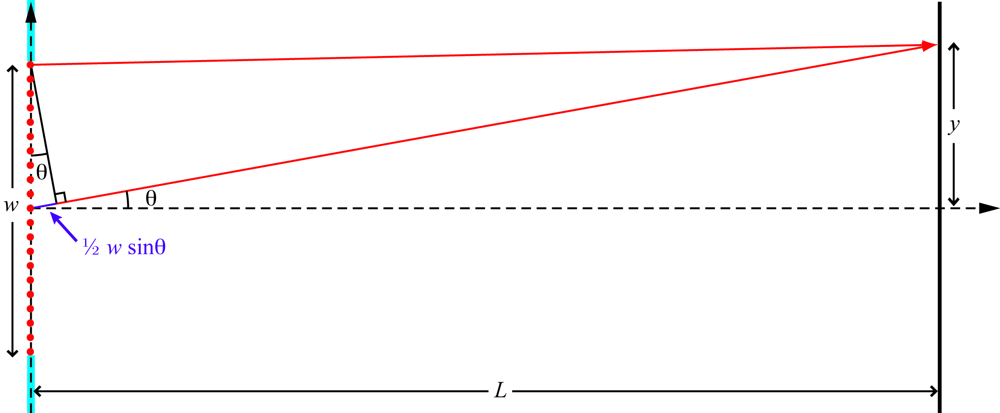
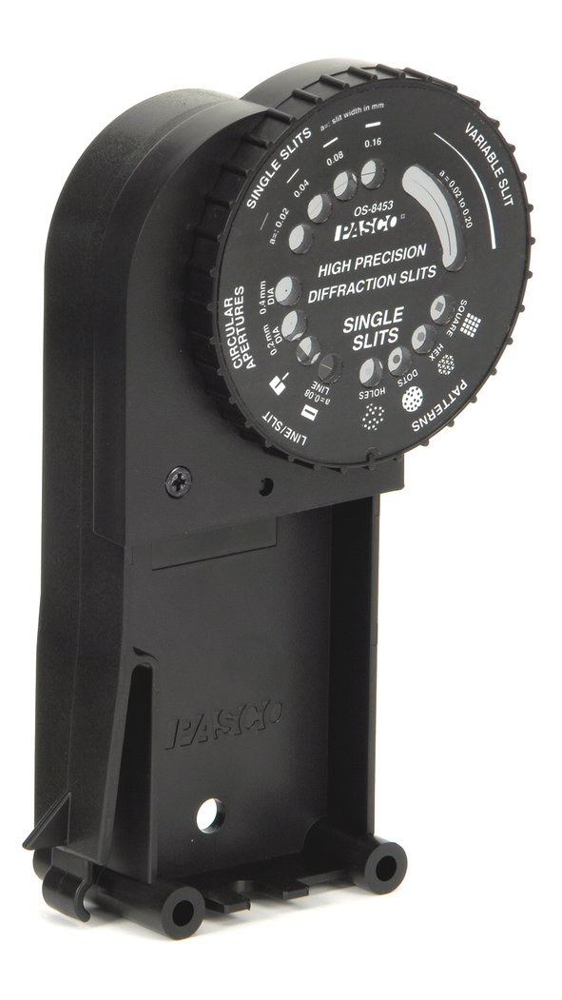
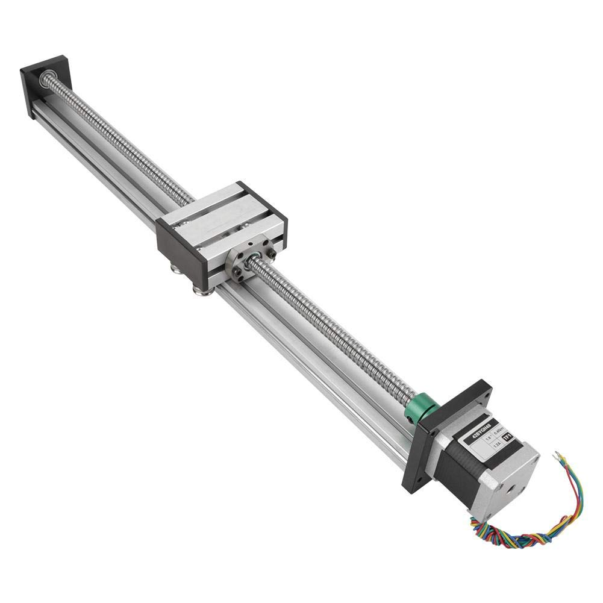
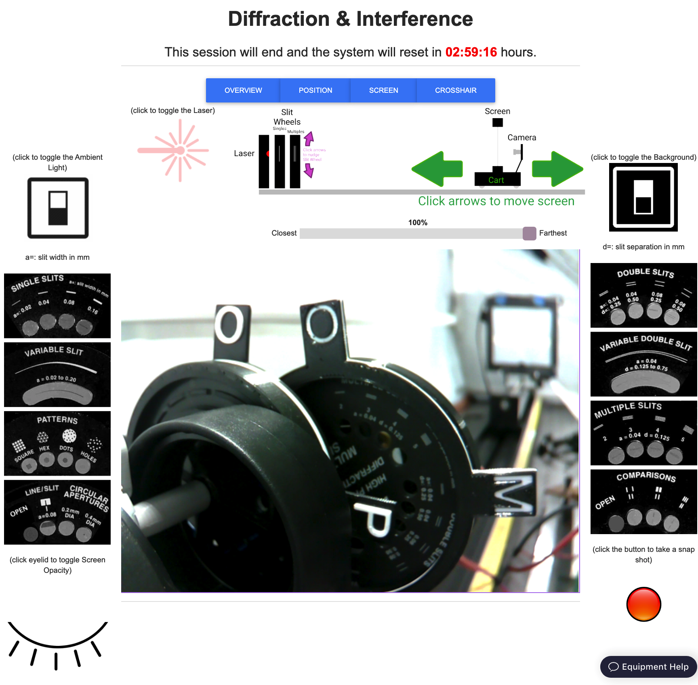
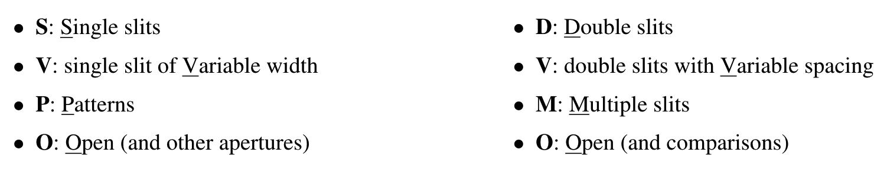
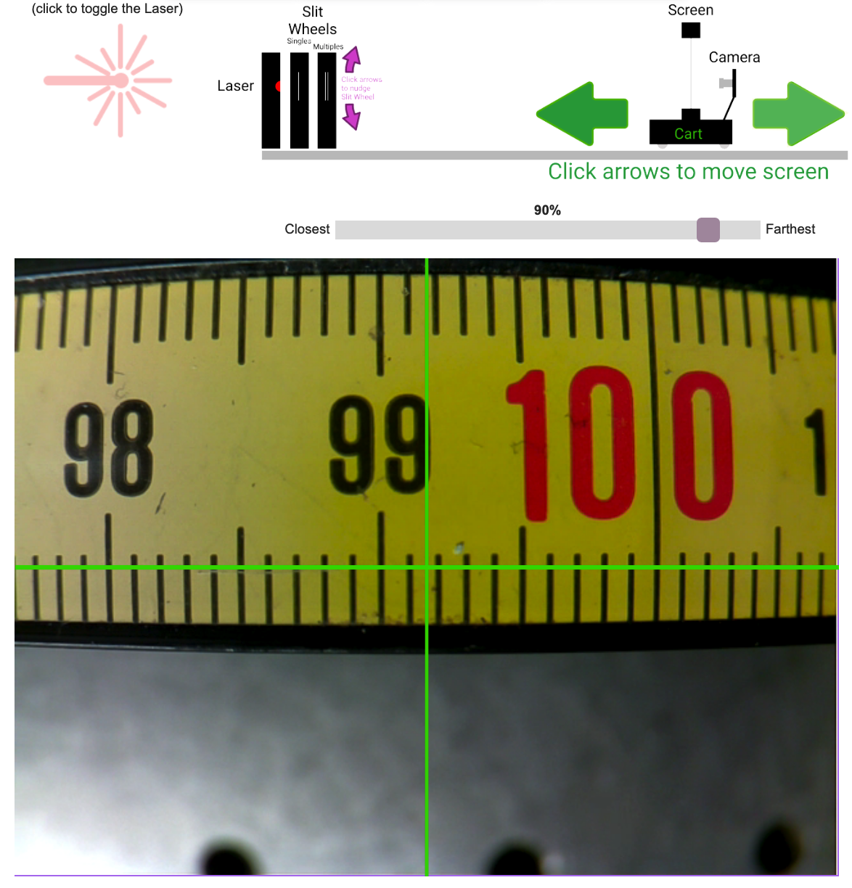
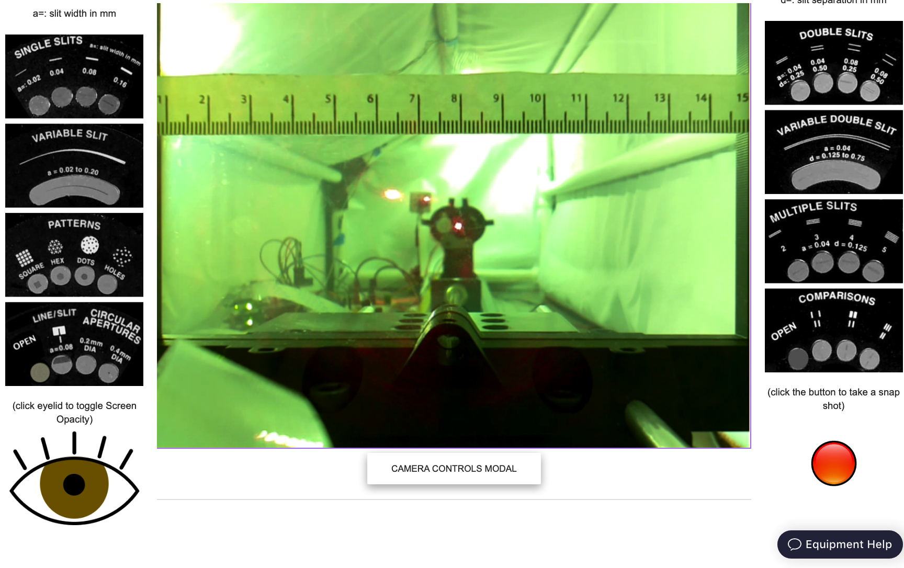
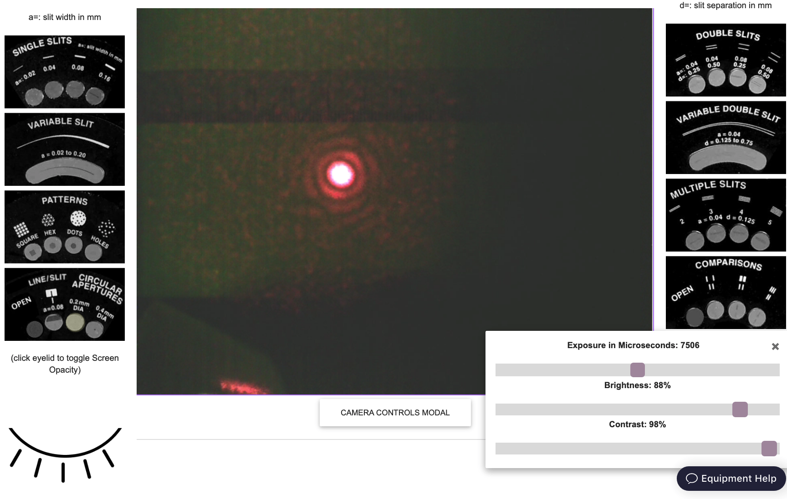
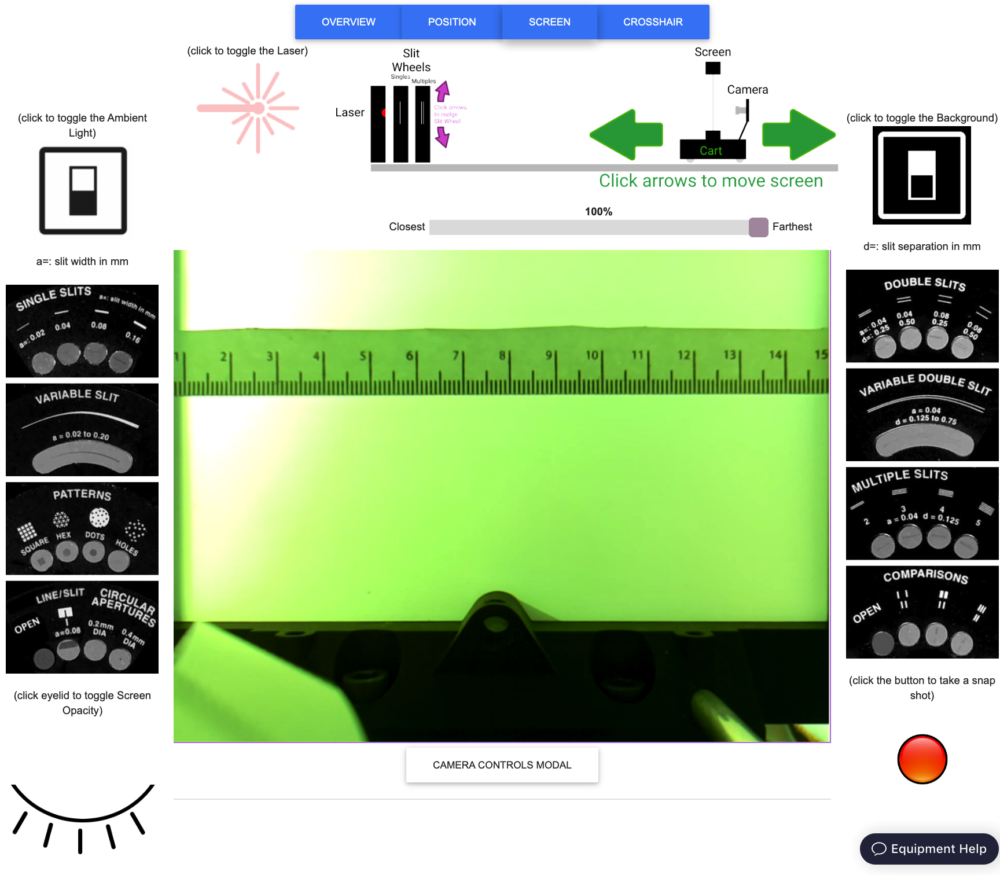

# Diffraction & Interference 
---

One of the most counter-intuitive, and fundamental, principles of Quantum Mechanics is *wave–particle duality*: the concept that every quantum-scale object cannot be fully described as either a particle or a wave alone.  In order to fully describe a quantum-scale object's behavior, both of these seemingly mutually exclusive paradigms must be used.
In this lab you will observe the wave behavior of light and use your observations to measure its wavelength.

Background
---------------------

Interference is a property of waves. 
Put simply, waves superimpose - meaning that, when more than one wave is present,  the amplitude at any position and time is the sum of all waves at that position at that time. 
If the superimposing waves are **periodic** and **coherent**, they combine in ways that lead to striking phenomena, which you've learned about in lecture courses: standing waves on a string, diffraction of water waves around a corner, and interference of sound from separated but otherwise identical sources. 
In this lab, you will examine the diffraction and interference of light waves, and then use these phenomena to determine the wavelength of the light from a laser. 
But first, you may find the following re-cap of the underlying physics useful.

Consider two point sources of light that are completely **coherent** (*i.e.*, they emit light of the same wavelength, and do so in phase with each other). 
 The light from each point source propagates in all directions, but for simplicity we will consider only a single plane. 
Suppose the point sources are separated by a distance $d$.
We'll use the $(x,y)$ plane and place the light sources at points $(0,0)$ and $(0,d)$.
We can then determine the intensity of the light at different points along a screen, placed a distance $L$ away on the $x$-axis, by considering the superposition of the two light waves at an arbitrary point, $(L,y)$, on the screen.

::: Figure:Figure

Light rays reach a point on the screen where their pathlengths differ by an amount $d\sin\theta$, with consequences discussed in the text.
:::

At the point $(L,d/2)$, the path length for each of the two light waves is equal. 
That means the two waves arrive at the screen in phase with each other, so they add (*i.e.*, interfere) constructively, and make a bright spot at that point.
At any other point on the screen, the path lengths of the two light waves differ, as shown in Figure 1, 
where the light that comes from the lower point travels an additional length $d \sin\theta$. 
This light arrives at the screen with a phase that is shifted by $\Delta\phi = 2\pi d\sin\theta/\lambda$ with respect to the light from the upper point. 
If the additional path length $d$ is such that $d \sin\theta = \lambda/2$ then the phase shift is $\Delta\phi = \pi$. 
That makes the wave from the lower point exactly the negative of the wave from the upper point, so they interfere destructively and that point on the screen is dark. 

:::Question
Calculate the $y$-coordinate of the point on the screen where this destructive interference occurs. 

Then repeat your calcuation assuming that $\theta$ is small (*i.e.*, $L \gg d$), then so that $\tan\theta \approx \sin\theta$
:::

Another special point on the screen, $(L,y_{constr})$, is where the path lengths of the two light waves differ by exactly one wavelength, *i.e.*, $d \sin\theta = \lambda$. 
 At this point, the phase of the light that travels the longer path is shifted with respect to that of the light that travels the shorter path by $\Delta\phi = 2\pi d\sin\theta/\lambda = 2\pi$, which has the same effect as no phase shift at all, so the two waves interfere constructively.  
 
:::Question
Calculate the $y$-coordinate of the point on the screen where this **con**structive interference occurs. 

Then, again, repeat your calcuation assuming that $\theta$ is small (*i.e.*, $L \gg d$), then so that $\tan\theta \approx \sin\theta$
:::

The pattern repeats for larger values of $y$: destructive interference occurs at any point for which $\Delta\phi$ is an odd multiple of $\pi$ and constructive interference occurs at any point where the phase difference is an even multiple of $\pi$.

An experimentally direct way to create two coherent light sources is to shine a single laser on something opaque that has two very small holes poked in it. 
If the holes are small enough, they will each behave as a point source from which spherical light waves emanate. 
Because the incident laser light is coherent, the holes will be coherent light sources.  

This is basically the approach that you'll use in this lab, but you'll use *slits* rather than holes. 
If the slit extends in the $z$-direction, a slit is the same as a hole as far as your calcuations in the $(x,y)$ plane above are concerned,
with the added benefit that a slit can be illuminated without having to aim the laser as carefully!

A possible problem with slits arises if the slits are not narrow enough to be truly ``point'' sources in the $(x,y)$ plane. 

To understand the consequences of passing light through a finite slit width, consider a single slit of width $w$.

::: Figure:Figure

Following Huygen's principle, a slit of width $w$ in a light-blocking material (blue) can be thought of as an array of coherent point sources (red dots) situated symmetrically across the $y$-axis, with consequences discussed in the text.
:::

Again considering only the $xy$-plane, it is easy to see that there is constructive interference at the point $(L,0)$ because, for every point source in the slit at a position of say $(0,y_1)$, there is another point source at $(0,-y_1)$, symmetrically across the $y$-axis, which therefore has the same pathlength to the point $(L,0)$. 
The result is constructive interference (*i.e.*, a bright spot) at $(L,0)$.  

Using a similar symmetry argument, it can be shown that destructive interference will also occur at some points $(L,\,y\neq 0)$.  Consider that light from the point at $(0,w/2)$ and light from the point at $(0,0)$ will arrive a point $(L,\,y\neq 0)$ on the screen after travelling different distances.  Their pathlength difference to the point $(L, L\tan\theta)$ will be $(w/2)\sin\theta$, as illustrated in Figure 2. When the value of $\theta$ is such that $(w/2)\sin\theta = n\lambda/2$, where $n$ is an integer, the light from those two points will arrive out of phase and destructively interfere.
Similarly, light from the point $(0,w/2-\Delta)$ will destructively interfere with light from $(0,-\Delta)$. 
In fact, as long as $L$ is so large compared to $w$ that $\sin\theta \approx \tan\theta$, the light from any point in the upper half of the slit will interfere desctructively with light from a point that lies a distance $w/2$ below it in the lower half of the slit, and the point $(L,y_{\rm destr})$ on the screen will be dark, where

:::Figure:Equation
$$
y_{\rm destr} = n \lambda L/ w, ~~{\rm where}~n=\pm 1, \pm 2, \pm 3, \ldots
$$
:::

The resulting pattern of light on the screen is called a *diffraction pattern*; it is a special type of interference pattern that results from light passing through different parts of a finite width slit. 
We say the light "diffracts" through the slit. 

:::Question
What happens to the position of the first ($n=1$) point of destructive interference (the one closest to the $y$-axis) when the slit gets narrower (*i.e.*, when $w \rightarrow 0$)?
:::

In this lab, you will look at both the diffraction pattern from a single slit and the interference pattern from two, or more, slits. 
The pattern from two slits will be a *convolution* of the interference pattern from the two slits and the diffraction from each slit. 

:::Figure:Figure

A typical pattern created by coherent light passing through two closely spaced, narrow slits.  Note that this pattern was created by a pair of slits whose spacing, $d$, is much larger than their width, $w$.
:::

:::Question
In Figure 3, what is being plotted in the vertical direction?  What is being plotted in the horizontal direction? 
:::

:::Question
In Figure 3, there is a solid line and a dashed line.  Which can be attributed to diffraction?  Which can be attributed to interference?  How can you tell? 
:::

Instruments
---------------------
The apparatus used in this lab consists of
* **A diode laser** - which provides collimated, coherent light.  

::: Figure:Figure
  

:::

* **A wheel of single slits and related apertures** - the relevant dimensions of which are printed adjacent

:::Figure:Figure

You can view the manufacturer's manual for these apertures on the web-portal for this experiment. 
:::
 
* **A wheel of multiple slits and related apertures** - the relevant dimensions of which are printed adjacent

:::Figure:Figure

You can view the manufacturer's manual for these apertures on the web-portal for this experiment. 
:::
 
* **An optical rail** - which makes it easy to mount all the optical elements in a straight line and determine their relative spacing along that line

:::Figure:Figure

:::

*  **A screen** - which can switch from transparent to opaque.

:::Figure:Figure

 The screen provides a nearly texture-free surface on which to view the light patterns.  
:::
    
* and, last but not least, **a translation stage** - which allows the user to change the position of the screen along the optical rail.

:::Figure:Figure

 
:::

Approach
---------------------
Using the instruments above,** you will study the light patterns created by a variety of single and multiple slit apertures, measuring their features and noticing how those measurements depend on the width of the aperture(s) and their separation from each other and from the screen.  Finally, using equations given in the Background section, you will determine the wavelength of the laser.  **

The web-portal for this experiment enables you to manipulate everything as you would in person, and observe the effects of your actions through a live video feed. Through it, you can turn the ambient light and the laser on and off, put any of over a dozen different single and double slits in the path of the laser beam, change the distance between the slits and the screen, and toggle the opacity of the screen. The video feed is displayed at the center of the portal and controls for slit wheel, screen and translation stage are distributed around it, along with links to helpful information.

There are three camera views available. 
The OVERVIEW camera looks down the optical bench from just behind the slit wheels.

:::Figure:Figure

Note the timer immediately below the title (in red).  When it runs out, the lab equipment will reset to its initial configuration.
:::

Select apertures on the "Single Slits" wheel (closest to the camera) by clicking on their images to the left of the live-feed.
Select apertures on the "Multiple Slits" wheel (further from the camera) by clicking on their images to the right of the live-feed.
Letters protruding from the wheels face the camera and let you know which set of apertures is positioned near the optical axis:

:::Figure

:::

When the ambient light is on, you should be able to see when the slit wheels are turning as well as when the unobstructed laser light is falling on the screen at the far end.

:::Figure

:::

The POSITION camera is rigidly affixed to the cart that carries screen and looks at a metric tape measure that is mounted along the rail, allowing you to measure the change in position when you move the screen.  Controls for moving the screen are positioned above the live feed.  There is a slider, which allows for large movements, and a pair of green arrows, which move the screen in small ($\sim 1$ cm) increments.

:::Figure:Figure

:::

The SCREEN camera looks down the optical axis from behind the screen.  
It is aimed directly at the laser and slit wheels, as can be seen by clicking the closed eye symbol in the lower left of the webpage, making the screen itself transparent. 

:::Figure:Figure

:::

Clicking again on the (now) open eye symbol makes the screen opaque again, allowing you to observe the laser light intensity patterns that result from the different slits.  There is a button below the live feed that opens a set of camera control sliders, allowing you to change the exposure time, brightness, and contrast of the screen image. 
These parameters can be adjusted to improve the visibility of the light patterns.

:::Figure:Figure

:::

Finally, when in the SCREEN view, clicking on the "crosshair" button makes a thin green cross appear at the position of the cursor in the live-feed and displays that position's coordinates in the upper-left corner of the live-feed.
Clicking once in the live-feed freezes the crosshairs' position.
Clicking again snaps it back to the cursor's position. 
With the ambient light turned on, a metric ruler taped to the screen provides a reference for converting pixels into centimeters or millimeters. 

:::Figure:Figure

:::

:::Exercise:
### Determine the number of pixels per centimeter 
*  Using the crosshairs, determine the coordinates of two positions that are separated by $1$ cm.
:::Question
What number of pixels per cm do you find?  Show your work.
:::
* Using the crosshairs, determine the coordinates of two positions that are separated by $10$ cm.
:::Question
What number of pixels per cm do you find now?  Show your work.
:::
:::Question
Which method is more precise?  Explain your reasoning.
:::
:::

Note that the red dot in the lower right of the screen is not yet functional.  If you want to capture an image of a light pattern for analysis in image processing software (*e.g.*, [Fiji](https://imagej.net/Fiji/Downloads)), use your operating system's screenshot function ("cmd-shift-5" on MacOS, "ctrl-shift-S" on Windows)

Measurement
---------------------
:::Exercise
### Gain familiarlity
The first thing you should do is play around with the remote setup to understand how it works. 
Rotate the slit wheels, move the screen and look at the different camera views. 
* Turn on the ambient light and switch to the OVERVIEW camera.
* Click on one of the single-slit apertures (in the left-hand column of the webpage). 
* Watch the slit wheel move.
* Click on one of the multi-slit apertures  (in the right-hand column of the webpage). 
:::Question
How do the slit wheels move in response to this second click?
:::
:::

:::Exercise
### Make qualitative observations
* Use the Single Slit wheel to view the diffraction patterns of *at least* three different slit widths. 
* Take screenshots of the patterns for your notes. 
* Somewhere on, near or clearly related to each screenshot, indicate the conditions that went into to creating it ( * e.g.*, slit width, exposure time, screen position) 

:::Question
How does the separation between maxima and minima change as the slit width changes?
:::
* Go to the smallest of the slit widths you used above. 
* Move the screen to the position furthest from the slits.
* Take a screenshot of the pattern for your notes. 
* Move the screen to the position closest to the slits.
* Take a screenshot of the pattern for your notes. 
* Somewhere on, near or clearly related to each screenshot, indicate the conditions that went into to creating it.
:::Question
How does the separation between maxima and minima change as the distance from the screen to the slit changes?
:::
* Use the Multiple Slit wheel to view the interference patterns of *at least* three different slit separations. 
* Take screenshots of the patterns for your notes. 
* Somewhere on, near or clearly related to each screenshot, indicate the conditions that went into to creating it ( * e.g.* , slit width, slit separation, exposure time, screen position) 
:::Question
How does the separation between maxima and minima change as the slit separation changes?
:::
:::

Now that you have some qualitative familiarity with the phenomena of diffraction and interference, 
it's time to measure the laser's wavelength. 
You will do this using the the Multiple Slit Accessory, with its given values of $d$,  measuring $L$ and $y$, and extracting $\lambda$ from the relations you derived in response to Question $1$ and Question $2$ above. 

:::Exercise
### Measuring the wavelength of the laser

* Move the screen to a position about half-way between its closest and farthest positions.
* Rotate the Multiple Slit wheel to place the 5-slit aperture in the path of the laser beam.
* Take a screenshot of the patterns for your notes. 
* Somewhere on, near or clearly related to the screenshot, indicate the conditions under which it was created.
* Note the position of the screen.
* Use the camera controls and the crosshairs to determine the positions of the intensity maxima.
:::Question
What was your procedure for determining the positions of the instensity maxima?
:::
* Move the screen closer to the slits and repeat.
* Move the screen farther from the slits and repeat.
* Move the screen as close to the slits as possible and repeat.
* Move the screen as far from the slits as possible and repeat.

$\Rightarrow$**Make sure your data  is clearly tabulated.**$\Leftarrow$
:::Question
How can you use this data to determine the wavelength of the laser?  (Hint:  See Questions $1$ and $2$.)
:::
* Plot the average distance between intensity maxima as a function of screen position.
* Perform a least-squared error linear regression (*i.e.*, fit a line to your data).

 $\Rightarrow$ **Make this a well-formatted plot!** $\Leftarrow$
 
:::Question
 Your fit should have two parameters: a slope and an intercept.  
 What are their values?  What do they each provide a measurement of?
:::
* Use the appropriate fit parameter to calculate the wavelength of the laser light.
* The manufacturer claims the wavelength is 650 nm.
:::Question
How large is the discrepancy between your measurement and the claimed value?

Calculate this *proportionate discrepancy* by taking the difference and dividing it by the claimed value:
$$
\frac{|\lambda_\mathrm{measured}-\lambda_\mathrm{claimed}|}{\lambda_\mathrm{claimed}}\,.
$$
Give your answer as a percentage.
:::

:::