# The Franck-Hertz Experiment 

---

When quantum mechanics was first proposed, some physicists wondered if it wasn't just a "[*trick of the light*](https://www.merriam-webster.com/dictionary/trick%20of%20the%20light)" because all the phenomena that motivated it (*i.e.* atomic spectra and the photoelectric effect)  involved light.
That changed when James Franck and Gustav Hertz provided evidence for quantum mechanics that did not involve light.
In this lab you will carry out a modern version of the Nobel-prize winning Franck-Hertz experiment.

Background
---------------------
Franck and Hertz didn't set out to validate quantum theory.  
They conceived their experiment in 1911, well before Niels Bohr proposed his model of the atom, with the goal of better understanding electron conductivity through gases.
But by the time they built their experiment, collected their data and reported their results it was 1914.
The Bohr model of the atom was about one year old. 

The Franck-Hertz data offered unequivocal evidence that an atom can accept energy only in discrete (*i.e.* quantized) amounts.
It was crucial to the acceptance of quantum theory because, at that time, photons were still somewhat mysterious 
but electrons were unquestionably real particles whose kinetic energy could be readily determined.

The experiment generates free electrons by heating a cathode inside an evacuated tube (*i.e.* a vacuum tube). 
The newly freed electrons accelerate towards an anode because a voltage difference, $V_a$, is imposed between the anode and the cathode.
As they move from cathode to anode, the electrons gain kinetic energy $eV_a$... unless they run into something along the way and undergo an inelastic collision. 

"*But what could the electrons run into?*"  you ask, "*Didn't you just say they are in an evacuated tube?*"  
Yes, the tube is evacuated, but it is not empty.  
There is a a small amount of mercury in the tube.  
When the tube is heated (in an oven), a low pressure gas of mercury atoms occupies the region between the cathode and anode. 
So the moving electrons can collide with, and scatter off of, the mercury atoms. 

Given that the mass of a mercury atom ($3\times10^{-22}$g) is  a few hundred thousand times the mass of an electron ($9\times10^{-28}$g),  if the two undergo an *elastic* collision the electron's kinetic energy won't change. 
However, if they undergo an *inelastic* collision, the electron would come away with less kinetic energy. 
If the atoms can absorb an arbitrary amount of energy,  the electrons that collide with them will lose energy no matter what the value of $V_a$. 
But, if the atoms can only absorb discrete energies from the electrons, 
the electrons that collide with them will only lose energy if their kinetic energy is greater than or equal to the lowest (or first) excitation energy of the mercury atoms. 

The Franck-Hertz experiment involves slowly increasing $V_a$ and measuring the kinetic energy of the electrons that reach the anode.

In theory, a sudden drop should occur when $eV_a$ reaches the first excitation energy $eV_1$. 
If the voltage is increased above $V_1$, 
an electron that excites a mercury atom in one collision can regain energy after the collision. 
When $eV_a$ reaches $2eV_1$, it becomes possible for an electron to undergo two interactions, 
and be left with little energy when it reaches the anode. 
This continues as the voltage is increased further; 
we should see drops in the electrons' final kinetic energy 
each time $V_a$ crosses an integer multiple of mercury's first excitation energy.

Ask yourself: What happens if $V_1 < V_2 < 2V_1$?

There are two complications in the actual experiment. 
First, it is not easy, or necessary, to directly measure the final kinetic energy of the electrons. 
It is simpler, and sufficient, to just measure how many electrons are above some kinetic energy threshold. 
This can be done by using a wire mesh for the anode, so the electrons can pass through it, 
and then placing a third electrode beyond it. 
Applying a retarding voltage, $V_r > V_a$, to that third electrode will allow only electrons with kinetic energy above $e(V_r - V_a)$ to reach it. 

Ask yourself: Where will the other electrons go?

Measuring the current collected by the third electrode tells us how many electrons have sufficient kinetic energy to reach it. 
If any electrons lose kinetic energy as they travel from the cathode to the anode, there will be a drop in the current through the ``collection electrode''.

The second complication is that the electrons don't have exactly zero kinetic energy or even zero potential energy when they leave the cathode.
There are small offsets due to the contact potential of the electrodes (the thermionic emission of electrons from the cathode requires a small amount of energy, 
similar to the work function of the metal that you encountered in measurements of the photoelectric effect.) 
As a result, the value of $V_a$ when the first current drop occurs is not a good measure of $V_1$. 
However, measuring the {\it difference in voltage between subsequent current drops} removes the bias and can be used to determine $V_1$.

Instruments
---------------------
The apparatus used in this lab consists of
* **A vacuum tube** - which contains a filament cathode (that ejects electrons upon heating), a wire mesh anode (that allows electrons to pass through it), a collection electrode (that receives only the most energetic electrons) and a small amount of Mercury (Hg, that transforms from liquid to vapor upon heating).  

::: Figure:Figure
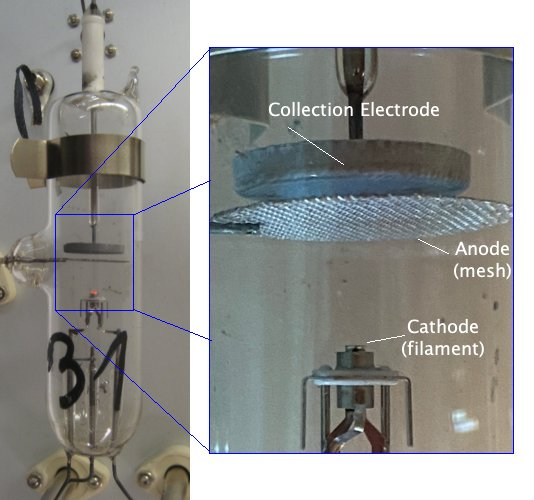

At left is a snapshot of the entire vacuum tube, as attached to the interior of the oven.  Note the droplet of liquid Mercury that has condensed on the glass in the lower half of the tube, just right of center, near the written numeral '1'. At right is an annotated close-up of the key electrical elements.
:::

Mercury vapor provides a dilute monoatomic gas for the free electrons to interact with.  The quantum structure and energy levels of its lowest lying excited states are given in the followng figure.

::: Figure:Figure
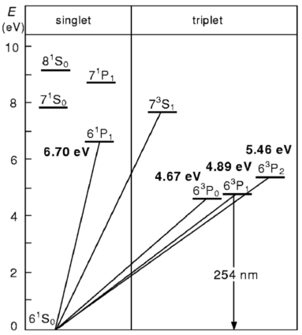

The lowest energy levels of the Mercury atom, labeled in [term symbol notation](https://en.wikipedia.org/wiki/Term_symbol). The four lowest transitions energies are written in bold near their corresponding diagonal lines. The vertical down arrow indicates a radiative transition back to the ground state and is labeled with the  wavelength of the corresponding photon. (From [Rapior, Sengstock and Baev, American Journal of Physics 74, 423 (2006).](https://doi.org/10.1119/1.2174033))
:::

* **An oven** - which heats the vacuum tube, vaporizing the Mercury.

:::Figure:Figure
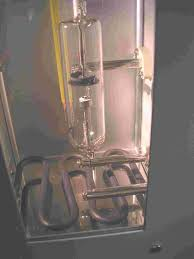
 
:::
 
* **A large variac** - which provides power to the oven.  

:::Figure:Figure
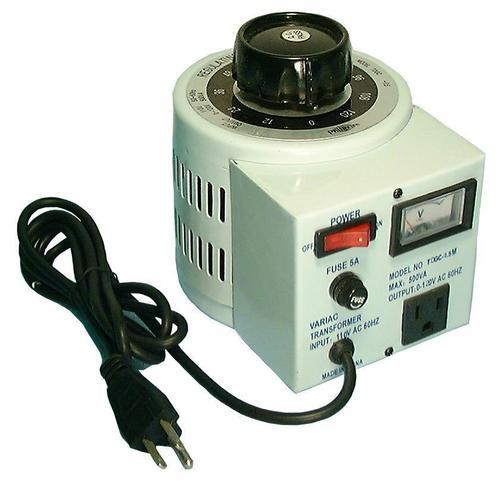

 This **VARI**able **AC** source is just a large transformer with a variable number of windings.  It connects resistive heating elements in the bottom of the oven to the 120V AC wall power.

:::

* **A small variac** - which provides power to heat the filament.  

:::Figure:Figure
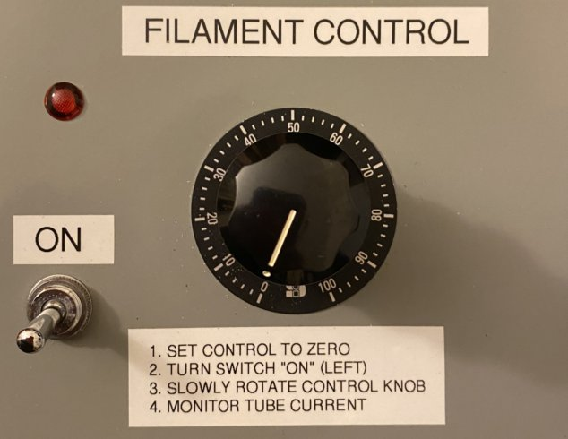

 Like the large variac, the small variac draws a variable amount of 120V AC wall power. However, instead of feeding current directly to the filament, the small variac's electrical connection goes through a second transformer.  This way, the electrical potential of the filament can be determined by a different circuit. 

:::

*  **Two variable voltage circuits** - one puts an adjustable voltage between the anode and the cathode to accelerate the electrons ($V_a$). The other sets the voltage between the anode and the collection electrode to retard electrons that pass through the anode ($V_r$), so that only the most energetic electrons are detected.   
  
The accelerating voltage comes from 

* **a DC power supply** - set to provide  40V .

:::Figure:Figure
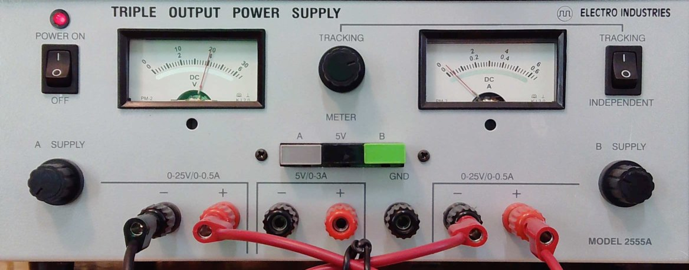 

:::

The retarding voltage comes from 
* **a D-cell battery** -  rated to provide 1.5 V.

:::Figure:Figure
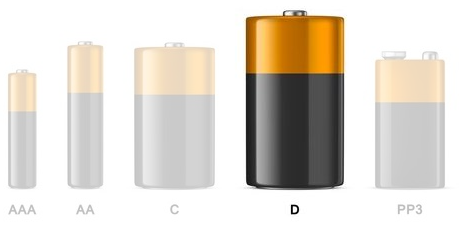 

:::

*  In both cases, a variable resistor – also known as a *potentiometer* or "pot" – is used to adjust the corresponding voltage.

:::Figure:Figure
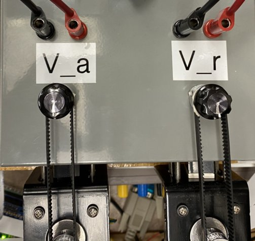

:::

* and, last but not least, **a sensitive electrometer** - which detects the electrons that make it to the collection electrode and can reliably detect mere fractions of a picoampere (1 pA = $10^{-12}$A).

:::Figure:Figure

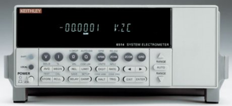

The manual for this meter is available in PDF format on the web-portal for this experiment. 
:::

Here is the **circuit diagram** for the entire apparatus.  
 
:::Figure:Figure
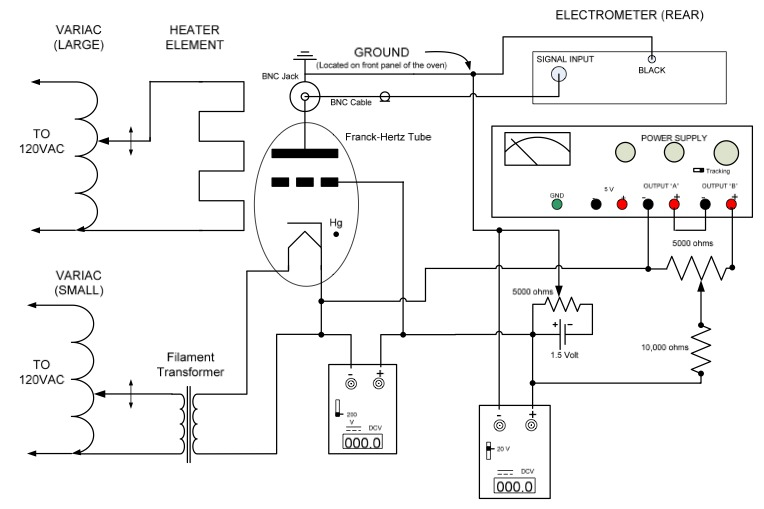

Note that the cathode is held at a more negative potential than the anode by the power supply, and the anode is held above ground by the battery. 
:::

    

Approach
---------------------
Using the instruments above,** you will measure the potential difference between successive minima in the current that arrives at the collection eletrode as you vary the accerating voltage imposed between the anode and the cathode (as explained in the Background section).  **

The web-portal for this experiment enables you to press and turn all the same buttons and knobs as you would in person, and observe the effects of your actions through four different live video feeds, each aimed at the apparatus from a different vantage point.  The video feed is displayed at the center of the portal.  Controls for the switches, knobs, and buttons are distributed around the video feed, along with links to helpful information.   A timer immediately above the video feed (in red) limits your time on the apparatus to 3 hours. When it runs out, the lab equipment will reset to its initial configuration.

You can switch between different views of the apparatus by clicking on one of the four blue buttons immediately below the timer and above the display.  As the display changes, so do the the images and controls that surround it.

The HEAT camera provides a top-down view of the large variac on the right, and of the oven on the left.  On top of the oven is the readout dial of a thermometer  that reports its internal temperature.  Around the live feed you will find a power switch you can click to turn the oven on and off and arrows you can click to turn the variac knob in either coarse or fine increments, as specified by the radio buttons.  

:::Figure:Figure

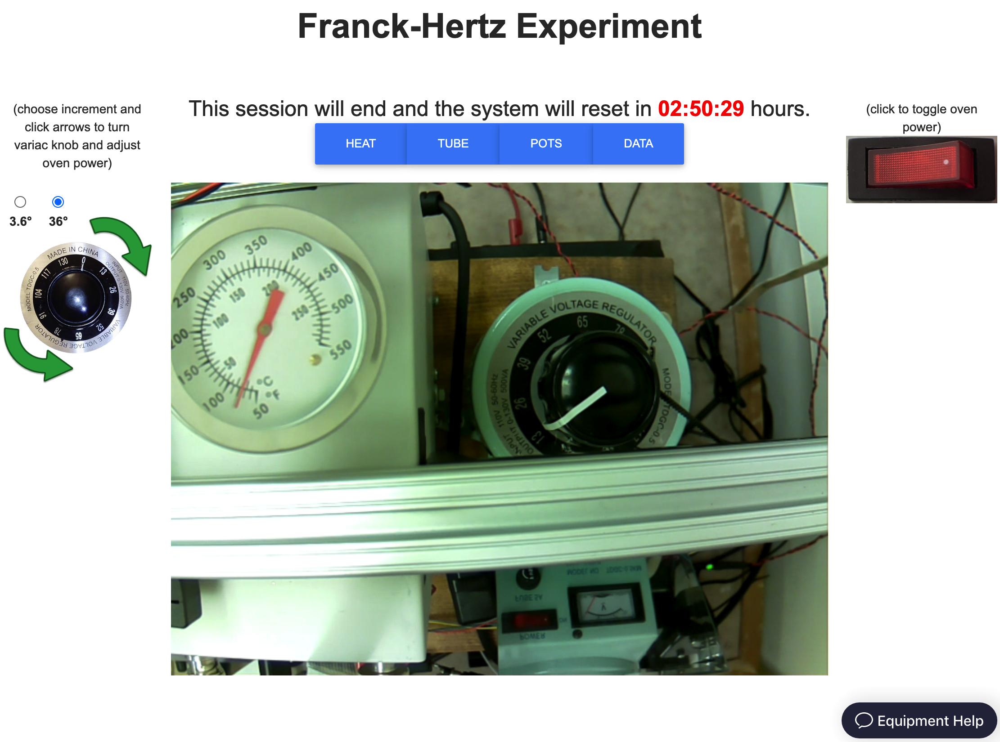

:::
The TUBE camera that looks inside the oven at the glass tube where the electron emissions and collisions will take place.  It  has a purplish color because it is an infra-red camera that illuminates the otherwise dark oven with a pair of infra-red lamps. Click on the Franck-Hertz tube icon on the left of live feed to look at the circuit diagram.  Click on the tube photograph to the right of the live feed to see a close-up of the tube's components and their names.

:::Figure:Figure

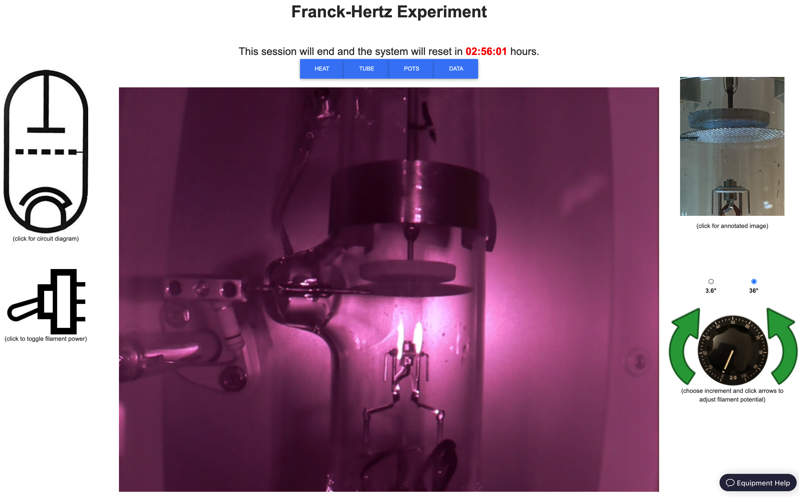

:::

The POTS camera looks down on a yellow multimeter that measures $V_r$, on the right, and a control box, on the left.  The control box has a switch and knob that control the filament variac, and, near the bottom of the screen, two potentiometers that control $V_a$ and $V_r$.  Surrounding the live feed are: a switch for toggling power to the filament (upper left), arrows for turning the filament variac knob (upper right), arrows for turning the $V_a$ pot (lower left) and arrows for turning the $V_r$ pot (lower right).  For each set of arrows, there is a set of radio buttons that determine the angular increment of one click.

:::Figure:Figure

:::

The DATA camera looks at the (yellow) multimeter that measures $V_a$ and  the Keithley electrometer that measures current through the collection electrode.  In the lower left you can also see the DC power supply (lower left), the back of the oven variac (upper left) and the bottom half of the side of the oven that has a window in it (upper middle). To the left of the video feed are the arrows for turning the $V_a$ pot.  To the right are the arrows for turning  the filament variac knob.  

:::Figure:Figure

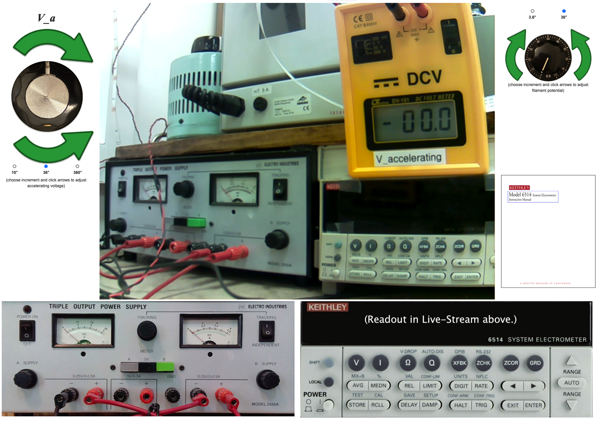

:::

Below the video feed are images of the faceplates of the DC power supply (left) and the Keithley electrometer (right).  The electrometer faceplate is actually a fully functioning interface!  Clicking on a button in the image will cause the device to respond exactly as if you had pressed the that button in person.

:::Exercise 
### Warming Up

The first thing you'll want to do for this experiment is warm up the oven to raise the vapor pressure of the mercury (Hg) in the tube.  

* Go to the HEAT view.  
* Click the red switch to power up the oven variac.  You should see the switch light up in the live feed.
* Click the green arrows to turn the variac knob and thereby adjust the power to the oven. 

The target temperature is in the $170^\circ$C – $190^\circ$C range, which corresponds to a vapor pressure of Hg of $\sim 1$ kPa. [[1]](https://www.govinfo.gov/content/pkg/GOVPUB-C13-66a1ade54071892930184393b1802e69/pdf/GOVPUB-C13-66a1ade54071892930184393b1802e69.pdf)

* Set the knob to about “78” on the variac’s scale, to start. 

Note that the thermal response time is large. It may take 10 - 15 minutes to warm up, and adjusting the variac knob will not cause an immediate change. It is best to make small changes and monitor frequently.

* As you work through the lab, monitor the oven temperature regularly and adjust accordingly.  

Next, you'll want to turn on all the other instruments, so they have time to warm up. 

Most equipment has a "warm up" period. This is simply the time it takes for all the heat production and dissipation mechanisms to come to equilibrium so that the device's components remain at a constant temperature.  Variations in temperature can alter operational details of electronics, such as amplifier gains and leakage currents. The electrometer in particular has calibration circuitry that measures and corrects for most temperature dependent effects, but operating at a stable temperature still improves its precision. 

* Go to the DATA view and turn on the electrometer.  

The Keithley 6514 electrometer is central to your measurement, so you may be curious to understand its operation. 
* Click on the manual coverpage above electrometer control panel and skim the user manual's table of contents.

You will notice that the  electrometer can be used to measure voltage, current, resistance or charge. When powered on, it defaults to voltage measurement mode.  For this lab, current measurement is the only relevant capability. 

* Switch to current mode using the front panel button.

The electrometer has ten ranges for current measurement, with the full scale
values ranging from 20 pA to 20 mA. 
:::Question
When the range is set to 20 pA full-scale, how many digits after the decimal point are displayed? 

How many electrons per second does a single unit in that smallest decimal place represent?  

(Recall that 1 Ampere = 1 Coulomb per second and 1 Coulomb $= 6.2\times10^{18}$ elementary charges)
:::

* Select an appropriate range for your measurements using the up and down arrows. 
* Set the RATE setting to SLOW 
* Set the DIGIT setting to display 2 or 3 digits after the decimal point. 

Displaying more digits provides greater precision, but temporal variations typically limit the usable level of precision.
:::

::: Exercise
The Keithley 6514 electrometer is capable of measuring very small currents with great precision, but that precision requires some careful procedures. In particular, it is helpful to calibrate and correct for any offset currents. This can be done with the Zero Check and Zero Correct functions. 

When Zero Check is enabled, the input signal is shorted so that the input amplifier sees only offset currents and voltages that are not part of the input signal and thus should be subtracted. That subtraction can, and should, be done internally using the Zero Correct function, following the procedure below. 

### Zero Correction procedure to remove offsets

1.  If you haven't already, select the current measuring mode by pressing I. 

2.  Select an appropriate measurement range.

3.  Press ZCHK to enable Zero Check mode. You should see a "ZC" message
    appear to the right of the units on the display.

4.  Press ZCOR to subtract the reading in Zero Check mode from future readings. You should see a "ZZ" message appear in the display.

5.  Finally, press ZCHK a second time to disable the Zero Check mode.
    You should see a "CZ" message appear in the display to indicate that the  readings are being corrected for any zero point offsets.

6.  If you ever want to abandon the Zero Correct mode, for example, if you want to check whether it is dramatically affecting your measurement, just press ZCOR a second time.

It is * **essential** * to repeat the zero correction procedure before making a measurement on a more sensitive scale than the last. The offset currents in the machine depend on the measurement scale.  If you correct the offsets at a less sensitive scale and then move to a more sensitive scale without repeating the zero correction procedure, the readings on the more sensitive scale will likley be incorrect because too large of an offest is being subtracted.
:::

:::Exercise
### Prepare for measurement
Once the oven temperature has stabilized at about $180^\circ$C, 

* Go to the POTS view and set the retarding potential to 1.3 V.

* Go to the DATA view and turn on the DC power supply by clicking the switch in the upper left hand corner of its faceplate.  You should see the needle of the left gauge move to the right in the live feed.
* Still in the DATA view, rotate the $V_a$ potentiometer clockwise until the $V_a$ meter reads ~$40$ V.
* Go to the POTS view, make sure the knob on the filament variac is set to zero (fully counter-clockwise), and turn on the filament.  You should see a light come on in the live feed. 
* Back in the DATA view, slowly increase the power to the filament by turning filament variac  knob until you get a current reading on the electrometer that is between $0.75$ and $1.0$ nA.  Try not to go much beyond $1.0$ nA and, if you do, reduce the filament power to lower the current to just below $1.0$ nA.

### Pay attention
As you reduce $V_a$, the current you measure may exceed $1.0$ nA, but the current you measure when $V_a = 40$ V shouldn't.
If you exceed $1$ nA before the filament variac knob has been turned more than about halfway, shut the filament off immediately and notify your TA.  This could indicate that the filament is overheating.
:::

Now that everything is on and functioning, you can begin making measurements.

:::Exercise
### Make a coarse measurement

If you followed the directions described above, $V_a$ is set to the highest value (~$40$ V) you'll want to use.

* Take a first round of data by reducing $V_a$ by ~0.5 V at a time and noting the electrometer current, $I$.  

$\Rightarrow\Leftarrow$ 

This is a coarse measurement, so don't bother waiting very long for the current to settle to a stable value.  Give it a few seconds and just jot its value down.

* After you've collected a few dozen data points, in this crude way, plot your data.

Write down salient details of what you notice in your logbook.
Then go back to taking crude data until you get to $V_a = 0$ V.
Again, plot your data and note any thoughts you have about it in your logbook.
In particular, think about what clues this crude data offers for how you should go about taking precision data.
:::

:::Exercise

### Make a more precise measurement
Make your first pass at taking precision data by increasing $V_a$ while monitoring $I$.  

It should increase at first, and then decrease after it crosses the point where electrons can excite mercury atoms. 
Collect data that will let you identify the $V_a$ at which $I$ peaks.
Make sure to describe your procedure for doing so in your logbook. 
Then continue to increase $V_a$ and you should see that the current goes through a minimum. 
Collect data that will let you identify the $V_a$ at which $I$ is its lowest.
Again, make sure to describe your procedure for doing so in your logbook. 

Continue to increase $V_a$ and similarly record the voltage and current for each of the subsequent peaks and minima 
until you reach the maximum possible value of $V_a = 40$~V. 
You should see about six cycles of current peaks and minima.

In addition to recording near the peaks and minima, 
you should record $I$ and $V_a$ at a few points between them. 
This will allow you to make a plot of the full $I(V)$ curve that illustrates the overall behavior.
:::

Determine the first excitation energy of mercury. 
Keep in mind that the absolute voltage is biased by potential offsets so, as explained in the introduction, 
instead of using the voltage values directly, 
you should use the differences between consecutive peaks or consecutive minima for your measurement.

\subsection{Going Beyond}

While you can obtain a measurement from a single scan, or even from just a couple peak positions, 
it is always a good idea to measure things repeatedly. 
Measuring the variation between multiple measurements helps to validate the results. 
You would be wise to take more than one scan.
:::

### Right Controls

:::Figure:Figure
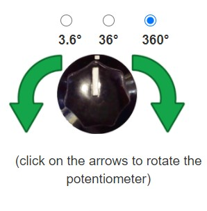
:::

A pair of green arrows to the right of the video feed allows you to turn the potentiometer knob clockwise or counter-clockwise.  The amount of rotation corresponding to a single click is determined by selecting one of the three radio buttons above the arrows.

::: Question
How many full rotations are required to sweep through the entire range of the potentiometer? *Hint:* "limit is reached" will be displayed on the screen.

What is the highest voltage you can apply?
:::

Measurement
-----------

There are four optical filters which only pass light in a narrow range of frequency. 
By placing these different filters between the Hg lamp and the phototube (see Exercise 1, Left Controls), you can measure the phototube's response as a function of the light's frequency, $\nu$. 

:::Exercise

With a filter in place, adjust the impeding voltage, $V$, until the photocurrent, $I$, reaches zero; 
the impeding voltage that stops all the current is the stopping voltage $V_s$. 
To make a more precise measurement of $V_s$, you could measure $I$ as a function of $V$ and fit the data to obtain $V_s$. 
* Take a quick, coarse scan to get an idea of the overall shape of $I(V)$. 

:::Question
Which filter did you choose?  
:::

:::Question
What is the overall shape of I(V)? 

Answer in words only.  Use adjectives like {positive, negative, increasing, decreasing, linear, non-linear},  verbs like {approaches, crosses, saturates} and adverbs like {near, far, above, below, at}.
:::

* Decide on a set of voltages that seem appropriate for the filter you chose and record a table of $I(V)$ measurements.

:::Question
What is $V_s$ for the filter you chose?
:::
:::

:::Exercise
* Repeat Exercise 3, answering all of the questions therein, for each of the remaining three filters.  
* Make sure to use the same method for determining $V_s$ for every filter.
:::Question
How did you determine $V_s$?
:::
:::

:::Exercise
* Plot $V_s(\nu)$. $\Rightarrow$**Make this the well-formatted plot you submit for grading. **$\Leftarrow$
* Fit your data to the equation 
$$
V_s =h\nu/e -\phi
$$
to obtain Planck's constant, $h$, and the work function, $\phi$, of the CsSb alloy. 
:::Question
What value did you use for $e$?
:::
The currently accepted value of Planck's constant is $h=(6.62606957 \pm 0.00000029)\times 10^{-34}~\mathrm{J s}$. [^3]
:::Question
How large a fraction of the accepted value is the discrepancy between your measurement of Planck's constant and the accepted value?

Calculate this *proportionate discrepancy* by taking the difference and dividing it by the accepted value:
$$
\frac{|h_\mathrm{measured}-h_\mathrm{accepted}|}{h_\mathrm{accepted}}\,.
$$
Give your answer as a percentage.
:::
:::

::: Exercise
There are five ND filters which attenuate the light at all frequencies equally. By placing these different filters between the Hg lamp and the phototube (see Exercise 1, Left Controls), you can measure $V_s$ as a function of the light's intensity.
::: Question
Design and perform an experiment to measure $V_s$ as a function of intensity.
:::
:::