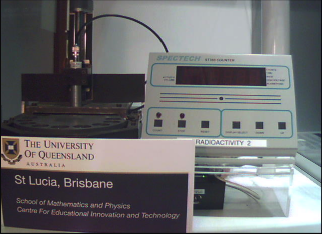

# PHYS 5L: $\beta$-Radiation Measurement & Absorption

Overview and Instrumentation 
------------------------------

***In this lab, you will explore the nature of radiation using [a remote-controlled apparatus hosted by the University of Queensland.](https://dispatcher.onlinelab.space/launchLabClient/1/1) ***

Clicking on the link above will take you to the Parameter Setup page.  There you will notice that the remote-controlled setup allows you to measure  radiation in a variety of situations by adjusting the  distance and by placing different absorbers between the source and the detector. 

The 'Webcam' tab at the top of the screen opens another page in your browser that displays a live feed of the apparatus so that you can observe it in operation and read the sensor's display directly. 

Once the experiment you set up has finished executing, the 'Results' tab (just left of the 'Webcam' tab) displays a chart of the sensor's readings at the end of each trial.

The first few times you use it, you should check whether the chart is trustworthy by watching the live feed, writing down the number of counts at the end of each trial (*i.e.*, when the red light above the 'stop' button comes on) and comparing what you observe to the values recorded on the chart.

The remote-controlled apparatus provides three different sources, one for each of the three types of radiation: $\alpha$ (alpha, Americium-241 ), $\beta$ (beta, Strontium-90) or $\gamma$ (gamma, Cobalt-60).  For the exercises below, you will use only the $\beta$-radiation from the Strontium-90 source. 

The remote-controlled apparatus also provides a wheel (horizontally oriented on the left of the live feed) which rotates the material of your choosing into (or out of) the path between the source  and the detector; 

and a detector, which augments a number on its display every time it senses a beta particle (or any other type of radioactive emission).  

The detector is called a Geiger counter, after its [inventor Hans Geiger](https://en.wikipedia.org/wiki/Geiger_counter#History).   It has two parts: a metallic cylinder (vertically oriented just above the wheel) 

and a grey box (on the right of the live feed) that are connected by an electrical cable (arching between them).

The cylinder contains a sealed tube of inert gas with an wire running down its axis (known as a Geiger-Müller tube).   The inner wall of the tube is also conducting and, when in use, a large voltage ($\gg 100$ V) is applied between the wire and the wall.  

Despite the large voltage, most of the time no current flows because the gas molecules are uncharged.  But when radiation passes through the tube, it ionizes some of the gas and the high voltage causes the ions and the released electrons to move quickly to opposite electrodes, resulting in a pulse of electrical current.  Every current pulse augments the count displayed on the grey box.

In addition to the numeric display, the grey box has a series of square buttons, with round lights above the two, leftmost buttons (Fig. 4).   When the machine is actively counting current pulses, the left of these two (above the button labeled **COUNT**) lights up.  When the machine has finished counting, that light turns off and the right one (above the button labeled **STOP**) turns on. If you're curious, you can [read more about the detector on the manufacturer's website](http://www.spectrumtechniques.com/products/instruments/st360/).

Activities 
--------------------

First, you will characterize the background level of radiation that is present.  Then you will measure the change in amount of radiation that reaches the detector as a function of its distance from the source.  Finally, keeping distance fixed, you will measure how the amount of radiation that reaches the detector changes when a piece of material is placed between them and how that change depends on the material's thickness.

### Background Radiation 
--------------------

In order to know how much radiation is coming from a source, it is necessary to first determine how much radiation is in the environment independent of the source.  This amount, called the radiation "background", can then be subtracted from measurements made with the source.

::: Exercise 

1. In the "Set Parameters" tab, from the drop down menu for "Choose Setup", pick  "Radioactivity over Time".

2.  In the list of avaiable sources, pick "None".
    Additionally, in the list of absorbers, pick "None".
    Finally, in the list of distances, pick any value.

3.  Run this setup for 10 trials, each 10 s long.  Note the number of counts for each trial as well as the total number of counts for all 10 trials.

4.  Repeat Step 3 at least three times.

::: Question
What distance did you pick?  How many times did you repeat Step 3?
:::

For perfectly independent, random events, the number observed in any given period of time will fluctuate.  If you repeat the measurement over and over again, and plot a histogram of the number of counts you observe in the same time interval, it will have a Gaussian, or bell-curve, shape, whose width, or "standard deviation" characterizes how reproducible your measurement is.

The average number of counts in a given interval can be calculated by adding all the individual observations and dividing by the number of observations:
$$ 
\bar{x} = \frac{1}{N}\displaystyle\sum_{i=1}^N x_i
$$

::: Question
What is the average number of counts you observed in a 10 s interval?
:::

::: Question
What is the average number of counts you observed in a 100 s interval?
:::

The standard deviation of your observations can be calculated by first noting how much each observation differs (or "deviates") from the average, then squaring each of those differences (or "deviations"), then taking the average of all those squared values, and finally taking the square-root of that average:
$$
\sigma_{x} = \sqrt{\frac{1}{N}\displaystyle\sum_{i=1}^N (x_i-\bar{x})^2}
$$ 

::: Question
What is the standard deviation of counts you observed in a 10 s interval?
:::

::: Question
What is the standard deviation of counts you observed in a 100 s interval?
:::
:::

::: Exercise 
For perfectly independent, random events, the standard deviation of the number of events observed should equal the square root of its average value, or "mean":
$$
\sigma_{x} = \sqrt{\bar{x}}
$$

::: Question
Does this relationship hold for your observations?
:::

It is customary to report measurements of radiation in terms of counts/time $\pm$ (standard deviation in counts)/time.  This is sometimes called the *level of radiation* at the detector.  The latter half of the expression specifies the interval in which a repeat measurement can be expected to fall 68% of the time (roughly two out of every three times the measurement is repeated).

::: Question
What is the background level of radiation (counts/time) you measured?  Make sure to include a 68% confidence interval in your answer.
:::
:::

::: Exercise 
Insert an absorber of your choice between the source and the detector and repeat steps 1-3 above.

::: Question
What absorber did you choose?   
:::
::: Question
What is the average background radiation in the room in the presence of that absorber? 
:::

:::Question
Does the background radiation level you measured with that absorber fall within the 68% confidence interval of the background level you measured without any absorber?  
:::

Repeat this measurement for a different absorber or for a different distance (*i.e.*, position) of the detector.

::: Question
What condition did you choose?
:::

::: Question
Does the background radiation level you measured under that condition fall within the 68% confidence interval of the background level you measured under your previous condition(s)?  
:::

:::

### Effect of distance 
--------------------------

Geiger counters are routinely used to locate sources of radioactivity.  This is possible because the amount of radiation detected varies with distance from the source.  

::: Question
How would you expect the amount of radiation detected to change (increase or decrease) as its distance from a detector increases?  Explain your reasoning.
:::

::: Exercise

1.  In the "Set Parameters" tab, from the drop down menu for "Choose Setup", pick  "Radioactivity over Distance".

2.  In the list of avaiable sources, pick "Strontium-90".
    Additionally, in the list of absorbers, pick "None".
    
3.  Run this setup at a 95 mm distance for one 10 s interval. Note the number of counts and adjust the interval and/or number of trials so that you observe a total of ~100 counts. Download the resulting chart by clicking on the menu icon in the upper right hand corner of the chart .

4.  Repeat Step 3 for a 15 mm distance.

5.  Repeat Step 3 for at least three other distances spread over the range of options between 15 mm and 95 mm.

6.  Tabulate your results
    
::: Question
What is the level of radiation (counts/time) you measured at a 15 mm distance?  Make sure to include a 68% confidence interval in your answer.
:::

::: Question
What is the level of radiation (counts/time) you measured at a 95 mm distance?  Make sure to include a 68% confidence interval in your answer.
:::

::: Question
What level of radiation (counts/time) did you measure at each of the other distances you tried?  Make sure to include a 68% confidence interval for each.
:::
:::

::: Exercise 

::: Question
Do either or both of your measurements at 15 mm and 95 mm fall within the 68% confidence interval of the background level you measured in the previous section?  
:::

If so, you can be reasonably confident that you are not detecting any raditation from the "source" at that distance.  If not, you can be reasonably confident that you are detecting radiation from the source at that distance.

::: Question
Do these measurements fall within one another's 68% confidence intervals?  What conclusion can you draw?  
:::

Subtract the level of background radiation you measured in the first exercise from the radiation levels you measured at each distance. Tabulate your results and plot radiation level as a function of distance  (radiation level on the $y$-axis, distance on the $x$-axis) with error bars to represent your 68% confidence intervals. $\Rightarrow$**Make this the well-formatted plot you submit for grading. **$\Leftarrow$

::: Question
Does radiation level increase or decrease with distance?
:::

::: Question
Is the relationship between radiation level and distance linear?
Suggest a possible explanation.
:::

:::

### Effect of Matter
-----------------------
We know radiation exists because of the interactions it has with matter.
The Geiger counter is a prime example:  the interactions result in ionization of gas molecules. 
To deal with, as well as detect, radiation, we need to understand not only the kinds of interactions it has, but also how likely those interactions are to happen.
The probability of interaction depends on the type of radiation and the type of matter, and also on the amount of matter per unit length along the radiation's path.

::: Question
With this in mind, suggest a possible reason for why is the Geiger counter's sensor is shaped like a cylinder (instead of, for example, a disk, a torus or a sphere) and oriented vertically in the apparatus.
:::

Interactions between radiation and matter typically result in energy being transferred from the radiation to the material. When this happens, we say the radiation "is absorbed" and the material is acting as an "absorber".
In the exercise below, you will observe how the amount of radiation absorbed depends on the distance it travels through a specific material: [Aluminum](https://en.wikipedia.org/wiki/Aluminium_foil).

::: Exercise

1.  In the "Set Parameters" tab, from the drop down menu for "Choose Setup", pick  "Radioactivity versus Absorber Foils".

2.  In the list of avaiable sources, pick "Strontium-90".
    Additionally, in the list of absorbers, arrange for only "Alum.Foil x1" and "Alum.Foil x64".
    
3.  Run this setup at a 15 mm distance for one 10 s interval. Note the number of counts and adjust the interval and/or number of trials so that the number of counts observed is >400 in all cases. 

4.  Change the setup to include all the different Alum.Foil absorbers as well as no absorber and the absorber of unknown thickness

5.  Run the setup and tabulate your results. (If you run more than one trial, the number of counts representeds by some bars may not be printed on the chart.  However, when hover your mouse over any one bar on the chart, the number of counts it represents will be displayed.)

::: Question
What level of radiation (counts/time) from the source passes through one layer of aluminum foil?  Remember to subtract the background level and to include a 68% confidence interval in your answer.
:::

::: Question
What level of radiation (counts/time) from the source passes through two layers of aluminum foil?  Remember to subtract the background level and to include a 68% confidence interval in your answer.
:::

::: Question
What level of radiation (counts/time) did you measure for each of the other thickness of foil?  Make sure to include a 68% confidence interval for each.
:::
:::

::: Exercise 

Compare the level of radiation passing through one layer of aluminum foil, call it $R_1$, to the level of radiation when there is no material bewteen the source and the detector, $R_0$, by calculating the **absorbance** (also sometimes called the *attenuation*) of one layer
$$
A(1) = -\ln \frac{R_1}{R_0}\,.
$$
Repeat this calcualtion for each of the different numbers of layers of aluminum foil.
Tabulate your results and plot absorbance, $A(n)$, as a function of number of layers, $n$. 
The points should lie along a line
$$
A(n) = \epsilon n
$$
where the slope $\epsilon$ is a characteristic of the foil that depends on its mass density, $\rho$, the thickness of a single layer, $\delta$, and a general, material-independent constant, $\lambda_{Sr-90}$, known as the **mass absorption length** for Strontium-90 that quantifies the propensity of its beta-radiation to interact with matter.
$$
\epsilon = \frac{\delta\rho}{\lambda_\mathrm{Sr-90}}
$$

::: Question
Using the known density of Aluminium, 
$$
\rho_\mathrm{Al} = 2.70\mathrm{g/cm}^3,
$$
and the known mass absorption length for Sr-90, 
$$\lambda_\mathrm{Sr-90} = 0.14\mathrm{g/cm}^2\,,
$$
what is the thickness of one layer of the aluminum foil indicated by your measurements?
:::
:::
Interestingly, measurements like this are used by manufacturers of all sorts of thin materials, from metal foils to plastic films to sheets of paper, for process and quality control of their product. [[1]](http://www.atigauge.com/how-html/)

Similarly, measurement of the absorption of gamma radiation is used in the manufacture of thick materials, and to test for flaws in critical parts (e.g., jet engines, pipeline welds, elevator and ski-lift cables, road subsurfaces). [[2]](https://www2.lbl.gov/nsd/education/ABC/wallchart/chapters/13/6.html)

<!--
Prelab questions 
1: which intermediate distances do you plan to use
2: what should you do if the number of counts representeds by a bar is not printed on the chart?
4: describe the two plots you will generate with the data you take? 
5: which of the questions can be answered after your time on the apparatus is over?
6: what else would you be interested to measure with this apparatus if you had unlimited time with it and why it might be interesting?

-->